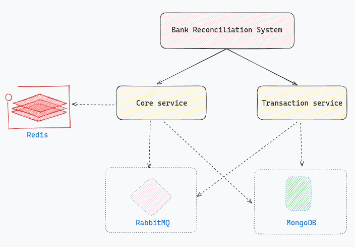
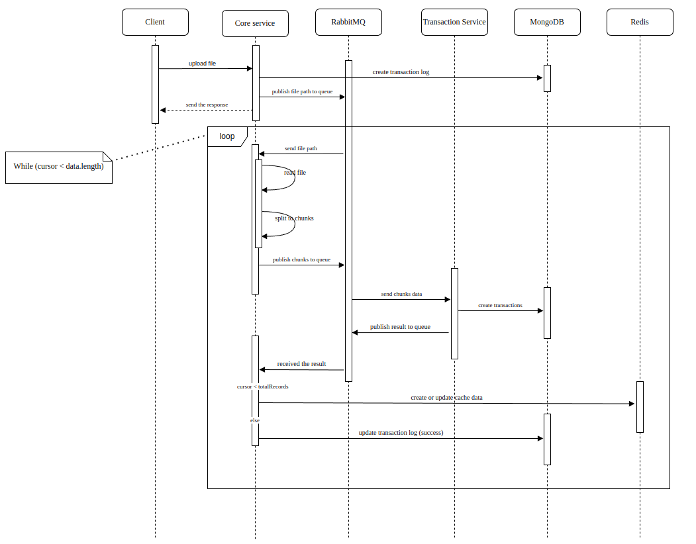

# Bank Reconciliation System

---

#### Table of contents

- [Diagrams](#1-diagrams)
- [Project Explanation](#2-project-explanation)
- [Folder Structure](#3-folder-structure)
- [Technologies Used](#4-technologies-used)
- [Running the Project](#5-running-the-project)
- [CURL Commands](#6-curl-commands)

---

## 1. Diagrams

- **System architect**
  

- **Sequence diagram for the import file process**
  

## 2. Project explanation

- Implemented a microservices architecture with **NestJS** in Monorepo mode, enabling efficient management and streamlined operation of multiple services within a single project. **RabbitMQ** for communication between these services, ensuring reliable and durable message-passing.

- Using the **Saga Pattern** to manage distributed transactions across services, coordinating updates and applying compensatory actions in case of failures to maintain data integrity. For caching, used **Redis** and applied a write-behind strategy, optimizing performance by asynchronously writing updates to the cache, thus reducing latency and request to database.

## 3. Folder structure

- `apps`: This directory contains the main application modules. In this project, there are two main applications: `core-service` and `transaction-service`.

- `libs`: This directory contains shared libraries that can be used across multiple applications.

- `apps/[service]/src`: Contains mainly code using across the service

  - `src/modules`: Contains the module, each module present for a object in the service
    - `modules/[module]/[module].controller.ts`: It handles the HTTP requests
    - `modules/[module]/[module].service.ts`: Contains business logic of the module
    - `modules/[module]/[module].module.ts`: Contains module that provides the necessary dependencies and configurations
    - `modules/[module]/__tests__`: Contains test files

- `Dockerfile`: Building a Docker image
- `docker-compose`: Define 6 services _core-service, transaction-service, mongo, mongo-express, redis, rabbitmq_
- `makefile`: Provides a way to define and execute commands easily
- `rest.http`: Used for `RestClient` extension on VSCode, includes all APIs endpoints

## 4. Technologies used

#### Versions in development:

| Technology     | Version |
| -------------- | ------- |
| PNPM           | 9.0.6   |
| NodeJs         | 21.0.0  |
| NestJS         | 10.0.0  |
| MongoDB        | latest  |
| Redis          | latest  |
| RabbitMQ       | 3.9     |
| Docker         | 25.0.2  |
| Docker compose | 2.24.5  |
| Ubuntu         | 23.04   |

#### Technologies:

- **NestJS**: Used as a core framework to config and build entry project because it promotes a modular architecture, allows developers to easily organize applications into modules, services, controllers, and testing. Easy to maintain, and scale up
- **MongoDB**: A core database to store all data in the project, flexible schema design, and easy to maintain and scale up
- **Redis**: Used as a caching database, store user auth and transaction logs.
- **RabbitMQ**: Used to implement communication between the core service and transaction service using multiple queues to ensure all transactions are consumed and handled reliably. This setup guarantees durability, allowing entities to persist through server restarts and automatically recreate once the server is back online.
- **Jest**: A testing framework for JavaScript, used for running unit tests.
- **Docker**: Used to to build, run and test services quickly and easily
- **Swagger**: Used to write the API documentation

## 5. Running the project

1. Ensure that the Docker engine is installed on your machine, and available below ports:

   ```bash
   8080 8081 8083 8085 5672 51672
   ```

2. Clone the repository to your local machine using the following command:

   ```bash
   git clone https://github.com/tranduykhang1/bank-reconciliation-system.git
   ```

3. Navigate to the project directory:

   ```bash
   cd bank-reconciliation-system
   ```

4. Copy `env` file

   ```bash
   cp .example.env .env
   ```

5. Install the project dependencies using the following command (**pnpm**):

   ```bash
   pnpm install
   ```

6. Start the services using the following command:

   ```bash
   make start
   ```

   or

   ```bash
   docker compose up -d
   ```

   _Run the command: `make restart` if any services are down_

7. Create the sample user using the following commands:

   ```bash
   make seed-db
   ```

   or

   ```bash
   #In the project folder
   docker compose exec core-service npx tsx apps/core-service/src/common/seeders/index.ts --refresh
   ```

8. To watch the service's logs, can use these commands:

   ```bash
   make core-logs #Core service logs
   make transaction-logs #Transaction service log
   ```

9. Services and ports:

   - _API docs_: **http://localhost:8080/api-docs**
   - _Core service_: **http://localhost:8080**
   - _Transaction service_: **http://localhost:8081**
   - _Mongo Admin_: **http://localhost:8083** `credentials: admin/pass`
   - _Redis Management_: **http://localhost:8085** `credentials: admin/admin`
   - _RabbitMQ Management_: **http://localhost:15672** `credentials: guest/guest`

10. Unit test **(coverage >85%)**:

```bash
pnpm test:cov
```

## 6. CURL commands or can use directly in the [rest.http](./rest.http) file or API docs mentioned above

- **Login** _(default `email/password` created by command `make seed-db`)_

```bash

curl --location 'http://localhost:8080/api/v1/auth/login' \
   --header 'Content-Type: application/x-www-form-urlencoded' \
   --data-urlencode 'email=client@bank.com' \
   --data-urlencode 'password=123123123'
```

- **Register new user (`Client` role)**

```bash
curl --location --request POST 'http://localhost:8080/api/v1/auth/register' \
--header 'Content-Type: application/json' \
--data-raw '{
    "email": "john@bank.com",
    "password": "123123123",
    "firstName": "John",
    "lastName": "Doe"
}'
```

- **Import a file**

```bash
curl --location 'http://localhost:8080/api/v1/files/import' \
--header 'Authorization: Bearer {{token}}' \
--form 'file=@"{{path_to_file}}"'
```
